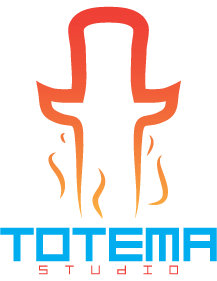

forked from https://gitlab.com/gableroux/unity3d

# Unity3d docker image

[](https://gitlab.com/gableroux/unity3d/commits/master) [](https://hub.docker.com/r/gableroux/unity3d/) [](https://hub.docker.com/r/gableroux/unity3d/) [](https://hub.docker.com/r/gableroux/unity3d/) [](https://microbadger.com/images/gableroux/unity3d) [](https://microbadger.com/images/gableroux/unity3d)

This project builds docker images for all unity versions and their components. It contains a script that generates a `.gitlab-ci.yml` that is used to build and publish all of the images.
all supported versions can be found in [`ci-generator/unity_versions.yml`](ci-generator/unity_versions.yml) (latest built images)  and [`ci-generator/unity_versions.old.yml`](ci-generator/unity_versions.old.yml) (already built images).

## Things to consider

These docker images run in a shell so you don't have access to Unity's UI. This docker image is intended to run unity commands with the **command line**. You can use it for running **tests** and **creating builds**.

## Usage

This docker image is intended to be used with a CI. An example project using unity3d in a docker image can be found at **[gableroux/unity3d-gitlab-ci-example](https://gitlab.com/gableroux/unity3d-gitlab-ci-example)**. Go there and follow its instructions if you'd like to use this image in your project.

### Build the image

Images are built automatically by the CI based on `.gitlab-ci.yml` content that is generated by **[./ci-generator](./ci-generator)**. If you'd like to build the image by yourself, you can do something like this:

```bash
docker build -t gableroux/unity3d:latest . -f unitysetup.Dockerfile
```

But at this point, you should fork the project, generate the the `.gitlab-ci.yml` and let gitlab build the image for you. By default, the images will be published to your fork's registry by default.

### Run the image

```bash
docker run -it --rm \
  -v "$(pwd):/root/project" \
  gableroux/unity3d:latest \
  xvfb-run --auto-servernum --server-args='-screen 0 640x480x24' \
  /opt/Unity/Editor/Unity -projectPath /root/project
```

## How it all started

This docker image was first based on [GitLab CI with Unity3D in Docker](https://www.projects.science.uu.nl/DGKVj16/blog/gitlab-ci-with-unity3d-in-docker/) but changed a lot.

## My version is missing, what can I do?

Have a look at the issues or merge requests. Have a look at the [ci-generator](./ci-generator) for documentation on how to add the missing version.

## How are these images published to docker hub?

Refer to this [QA](https://stackoverflow.com/questions/45517733/how-to-publish-docker-images-to-docker-hub-from-gitlab-ci). tldr; I only updated a few environment variables in gitlab-ci settings, this is optional.

## Shameless plug

I made this for free as a gift to the video game community. If this tool helped you, feel free to become a patron for [Totema Studio](https://totemastudio.com) on Patreon: :beers:

[](https://patreon.com/totemastudio)

[](https://www.patreon.com/bePatron?c=1073078)

## Want to chat?

Join us on our discord channel at [totema.studio/discord](https://totema.studio/discord), there's a technical channel in there mostly dedicated to this tool. :+1:

## License

[MIT](LICENSE.md) © [Gabriel Le Breton](https://gableroux.com)

